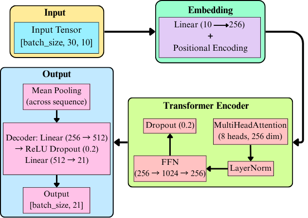
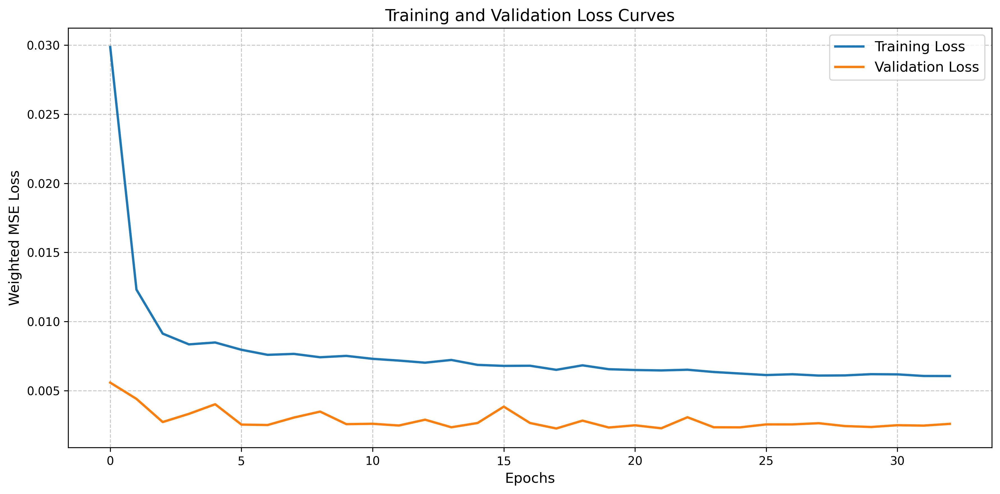

<h1 align="center">🌫️📡 Emission Monitoring and Forecasting using 🤖 Transformer-based Deep Learning 📈🌍</h1>


<p>
  <b>🚀 Predictive Modeling of Air Quality Index (AQI) using a Transformer Network</b><br>
  📅 Data: US Pollution Data (2000–2016) • 📍 Source: Kaggle<br>
  📉 Multi-target AQI Forecasting (SO2, NO2, CO)
</p>

---

## 🧠 Project Summary

This project explores time series forecasting for environmental pollutants (**SO2, NO2, CO**) using a **Transformer-based deep learning model**. It processes real-world US Pollution data, performs exploratory data analysis, applies time-based feature engineering, and uses a custom positional encoding to feed a multi-headed self-attention architecture.

The final model achieves **R² = 0.944** across targets and is capable of **multi-day forecasting (7 days)** with interpretability and efficient training.

---

## 📁 Dataset

- 📦 **Source**: [Kaggle – US Pollution Dataset (2000–2016)](https://www.kaggle.com/datasets/sogun3/uspollution)
- 💡 **Features Used**: `SO2 AQI`, `NO2 AQI`, `CO AQI`, `O3 AQI`, `Date Local`, derived temporal features
- 📈 **Targets**: `SO2 AQI`, `NO2 AQI`, `CO AQI`

---


## 🧾 Project Overview

<div style="width:100%; overflow-x:auto; margin:1em 0; font-family:Arial, sans-serif;" align = "center">

| Attribute         | Description                                                                |
|-------------------|----------------------------------------------------------------------------|
| **📚 Frameworks**   | PyTorch, NumPy, Pandas, Matplotlib, Seaborn                              |
| **📊 Model Type**   | LSTM/GRU-based multivariate time series forecasting                      |
| **🌫️ Target Gases** | CO, NO₂, SO₂                                                             |
| **🎯 Output**       | AQI prediction & visual analysis                                          |
| **🧪 Notebook**     | `aqi_forecast_model.ipynb`                                                |
| **📁 Dataset**      | Public AQI dataset (structured, multivariate time series)                 |

</div>

---

## 🧠 Model Architecture

<p align="center">
  
</p>

The architecture consists of a multi-layered recurrent neural network designed for multivariate time series forecasting. The input features include pollutant concentrations, temperature, humidity, and other atmospheric indicators. The model uses:

- **Encoder-Decoder LSTM/GRU** structure
- **Dense layers** for final regression
- **Sequence-to-one and sequence-to-sequence** modes for single-step and multistep prediction

---


## 📉 Loss Curves

<p align="center">
  
</p>

These plots illustrate the training and validation loss over epochs. The steady decrease indicates effective learning without major overfitting.

---

## 📊 Target Trends Over Time

<p align="center">
  
</p>

The visualization shows trends and seasonal patterns in pollutant levels, offering insight into time-dependent fluctuations and anomalies.

---

## 🧪 Results by Pollutant

### 🧪 Model Evaluation

<div align="center">
  


| Target     | MSE     | RMSE    | MAE     | R²      | sMAPE (%) |
|------------|---------|---------|---------|---------|-----------|
| **SO₂ AQI** | 1.1088  | 1.0530  | 0.8089  | 0.1646  | 31.1884   |
| **NO₂ AQI** | 9.0817  | 3.0136  | 2.3526  | 0.6106  | 12.6728   |
| **CO AQI**  | 0.4192  | 0.6475  | 0.4816  | 0.7543  | 11.2381   |

</div>

---

### ✅ Overall Test R² (combined targets): `0.9441`

---

### 🔵 **CO Forecasting Results**

<div align="center">
  
| Metric/Graph | Description |
|--------------|-------------|
| 📈 `CO AQI_actual_vs_pred.png` | Predicted vs Actual AQI for CO |
| 📉 `CO AQI_error_dist.png` | Distribution of prediction errors |
| 🧠 `CO AQI_multistep_pred.png` | Multistep forecast of CO levels |
| 🖼 `CO AQI_predictions.png` | General predictions over time |

<h3 align="center">📈 CO AQI Prediction Visualizations</h3>

<p align="center">
  
  
</p>

<p align="center">
  
  
</p>

</div>
---

### 🟡 **NO₂ Forecasting Results**

<div align="center">

| Metric/Graph | Description |
|--------------|-------------|
| 📈 `NO2 AQI_actual_vs_pred.png` | Predicted vs Actual AQI for NO₂ |
| 📉 `NO2 AQI_error_dist.png` | Error distribution for NO₂ |
| 🧠 `NO2 AQI_multistep_pred.png` | Multistep forecast |
| 🖼 `NO2 AQI_predictions.png` | Predictions over time |

<h3 align="center">📈 NO₂ AQI Prediction Visualizations</h3>

<p align="center">
  
  
</p>

<p align="center">
  
  
</p>

</div>

---

### 🟠 **SO₂ Forecasting Results**

<div align="center">


| Metric/Graph | Description |
|--------------|-------------|
| 📈 `SO2 AQI_actual_vs_pred.png` | Predicted vs Actual AQI for SO₂ |
| 📉 `SO2 AQI_error_dist.png` | Error distribution |
| 🧠 `SO2 AQI_multistep_pred.png` | Forecast for multiple time steps |
| 🖼 `SO2 AQI_predictions.png` | Time series of predictions |

<h3 align="center">📉 SO₂ AQI Prediction Visualizations</h3>

<p align="center">
  
  
</p>

<p align="center">
  
  
</p>

</div>

---

## 📊 Correlation Matrix

<p align="center">
  
</p>

This matrix shows how different atmospheric features are correlated. It helps identify dominant contributors to AQI fluctuations.

---

## ✅ Conclusion

This work demonstrates the effectiveness of **recurrent deep learning models** in **AQI forecasting**, particularly in urban air quality scenarios. By targeting pollutant-specific patterns and leveraging multivariate input data, the models provide accurate, timely predictions for:

- 🚗 **CO**
- 🏭 **NO₂**
- 🌋 **SO₂**

---

## 🔮 Future Directions

- 📍 Incorporate GPS and geo-tagging data  
- 🌍 Fuse satellite imagery for better spatial insights  
- 📡 Integrate real-time sensor data streams  
- 🎯 Use Transformer-based architectures for long-term forecasting  

---

## 🚀 How to Execute This Project

Follow the steps below to clone and run this project on your machine:

---

### 1️⃣ Clone the Repository

```bash
git clone https://github.com/shreyakmukherjee/emission-monitoring-prediction.git
cd emission-monitoring-prediction
```

### 2️⃣ Install Required Libraries

Ensure you have **Python 3.8+** installed. Then install all required dependencies:

```bash
pip install -r requirements.txt
```

✅ The requirements.txt includes all necessary packages such as:
torch, sklearn, matplotlib, seaborn, pandas, numpy, etc.

### 3️⃣ Prepare the Dataset

📂 Place your dataset file (e.g., `emission_data.csv`) in the `data/` directory.  
🛠️ If your file is named differently or located elsewhere, update the file path in the notebook/script accordingly.

---

### 4️⃣ Run the Jupyter Notebook

Launch the notebook using **Jupyter** or your preferred environment:

```bash
jupyter notebook emission_forecasting.ipynb
```

📊 This notebook performs:

- Data preprocessing
- Training Transformer-based models
- Visualization of AQI predictions and errors

---

## 🙌 Acknowledgements

📊 Dataset by [Mateusz Buda on Kaggle](https://www.kaggle.com/datasets/mateuszbuda/lgg-mri-segmentation)  
⚙️ Frameworks: **PyTorch**, **Albumentations**, **timm**, **torchvision**  
💻 CUDA for GPU acceleration

---

## 📬 Contact

**Shreyak Mukherjee**  
📧 shreyakmukherjeedgp@gmail.com  
📍 Durgapur, West Bengal  
🔗 [LinkedIn](https://www.linkedin.com/in/shreyak-mukherjee-203558275/)

